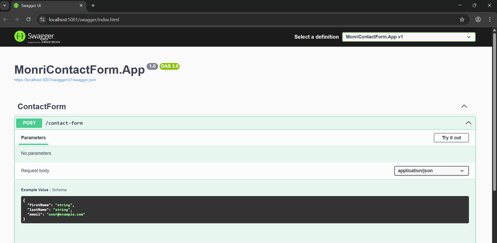

# ContactFormAPI

**ContactFormAPI** is a simple .NET Web API application that exposes a single endpoint to collect and enrich user data, store it in a SQL Server database, and send an email to the user with their full information.

## 🧩 Project Structure

This solution is organized into four main projects:

- **App**: Contains controllers and application-wide configuration such as dependency injection, middleware setup, and rate limiting.
- **Core**: Holds all business-related logic, models, entities, and interface definitions.
- **Infrastructure**: Handles database access via ADO.NET, external API communication, and email sending functionality.
- **Tests**: Contains both unit and integration tests for all layers of the application using **xUnit**.

## 🚀 Features

- Accepts contact requests containing `first name`, `last name`, and `email`.
- Enriches user data by fetching additional information from an external **Users API**.
- Persists user data to a **SQL Server** database (no ORM, uses **ADO.NET**).
- Sends an email to the user containing all their available details via **SendGrid**.
- If the user already exists in the database, their data is updated. If not, a new record is created.
- Enforces a rate limit of **1 request per minute per client** using `AspNetCoreRateLimit`.
- Custom **Exception Middleware** for global exception handling.

## 🛠️ Technologies Used

- **.NET 8**
- **ADO.NET** (no ORM)
- **SendGrid** (with registered API key)
- **Typed HttpClient** for external API calls
- **AspNetCoreRateLimit** for request throttling
- **xUnit** for testing

## 📬 Contact Flow Overview

1. A `POST` request is made to the contact endpoint with the following fields:
   - `FirstName`
   - `LastName`
   - `Email`

2. The API:
   - Checks if a user with the given email exists in the database.
   - Calls an external Users API to try and enrich the user data.
   - Updates or creates the user record based on the information received.
   - Sends an email with all user details to the provided email address.

## ▶️ Running the Application

To run the API locally (the database and Users table will be created automatically if it does not exist):

```bash
dotnet run
```

